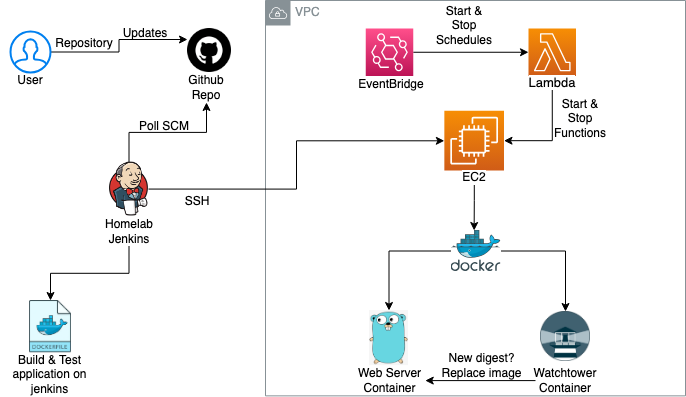
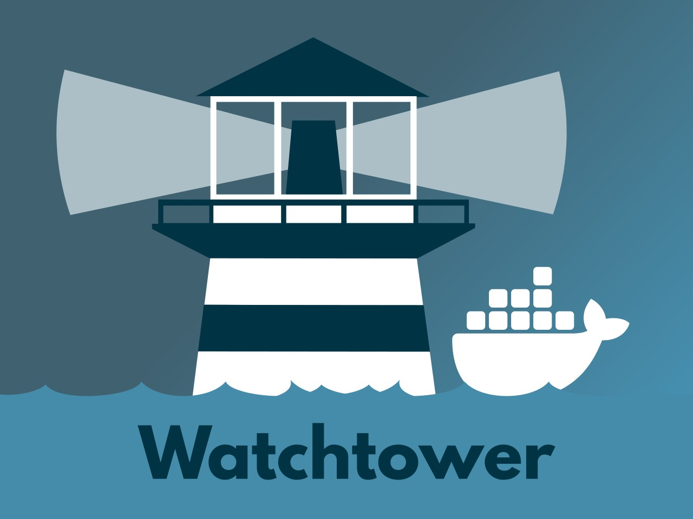
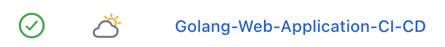
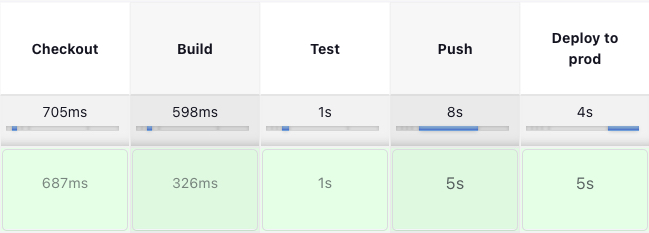
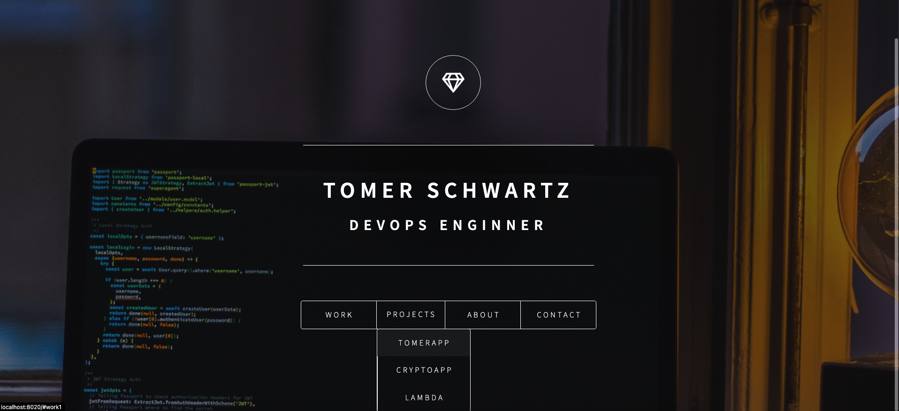

# MarketMe Web Server | tomerschwartz.com
## Containerized golang web application with full CI/CD process using Jenkins & WatchTower
## Tools | Jenkins | WatchTower | EC2 | AWS Lambda | AWS EventBridge | Docker & Dockerfile | 
   <br>

* This project is deployed on AWS EC2 and enchanced by Lambda functions & EventBridge in order to stop the instance at 00:00 IDT and start at 07:00AM IDT to optimize costs.
* The included Dockerfile is building the application using multi-stage building.
* The end result image in no more than 15mb thanks to the "Scratch" docker image which is the smallest image out there.
* a jenkinsfile is also included in order to build the application & test & push it to dockerhub and deploy it .  
* My home lab Jenkins Server runs a pipeline to build the golang application when a push is detected using the Poll SCM option.
* WatchTower is enabling a full continuous deployment proccess with minimal downtime for containers, <br> 
  1. a watchtower container is deployed whenever the jenkins pipeline has reached the prod       stage, <br>
  2. it will search for an updated digest inside the docker registry, if a newer one is found it will update the image on the web server.  
  <br>
   
  
  
   <br>
   <br>
   <br>
   <br>

### __How to run the application in localhost__:
1. clone the repository
```
git clone https://github.com/tomerschwartz24/MarketMe-CI-CD.git
```
2. cd to Projects directory
```
cd MarketMe-CI-CD
```
3. Build the application image 
```
docker build -t marketme:1.0 -f Dockerfile .
```
4. Run the built image 
```
docker run -p 80:80 -d marketme:1.0 
```
